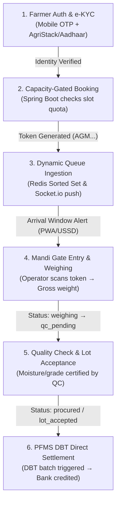

# AnnSetu (अन्न सेतु) — Smart India Hackathon Pitch Deck
**Problem Statement:** Smart India Hackathon (DA&FW) | Interoperable Procurement & Real-Time Queues  
**Format:** Exactly 5 Slides (16:9 Landscape) | Designed for 8–10 Second Judge Comprehension  
**Interactive Deck:** [`docs/pitch_deck/annsetu_sih_pitch_deck.html`](file:///Users/shubham/Drive%20D/Custom_Projects/SIH_2026/AnnSetu/docs/pitch_deck/annsetu_sih_pitch_deck.html)

---

## Slide 1: Idea Title & Proposed Solution

### Header
- **Eyebrow:** Smart India Hackathon 2026 • Problem Statement SIH-2026
- **Title:** AnnSetu: Real-Time Procurement Queues for Every Farmer
- **Subtitle:** Farmers know when to arrive, follow every procurement step, and track payment on any phone.

### Core Problem Insight
> 💡 **Core Insight:** A procurement token confirms eligibility. It does not tell a farmer when the center will actually serve them.

### Before vs After: Farmer Journey Comparison
| Current Reality (Blind Waiting & Uncertainty) | AnnSetu Flow (Predictable, Dignified Arrival) |
| :--- | :--- |
| **1. Static Token:** Issued for an arbitrary calendar date | **1. Verify:** Single AgriStack Farmer ID & Aadhaar e-KYC |
| **2. Early Rush:** Farmer arrives at 6 AM; mandi already choked | **2. Book:** Valid slot gated by center daily throughput |
| **3. Blind Waiting:** 6–14 hours idling with laden tractor | **3. Track:** Dynamic queue position & accurate arrival window |
| **4. Costly Deferral:** Turns spilled over; multiple transport trips | **4. Alerts:** Multi-channel pings via PWA, SMS, USSD, or IVR |
| **5. Opaque Payment:** No clarity on payment stages or delays | **5. Procure & Pay:** Milestone visibility: Gate → QC → PFMS DBT |

### 3 Key Differentiators
1. **Single Interoperable Experience:** One farmer identity across multiple state procurement portals without repeated registrations.
2. **Capacity-Aware Live Visibility:** Prevents overbooking at mandi gates by converting static tokens into live queue positions.
3. **100% Inclusive Channel Access:** Equal experience on smartphone PWA and zero-internet feature phones (USSD / IVR).

### Innovation Statement
> 🚀 **Innovation:** AnnSetu improves existing procurement portals instead of replacing them.  
> *(Pluggable Adapter Model • Zero Greenfield Risk)*

### Slide Footer
- **Sources:** PM-AASHA Procurement Guidelines • DAC&FW AgriStack Architecture • Digital India Mandi Survey  
- **Slide 1 of 5**

---

## Slide 2: Technical Approach

### Header
- **Eyebrow:** Architecture & Engineering Specification
- **Title:** Two-Service Architecture with Government Integration Adapters
- **Subtitle:** Engineered for solo developer velocity, sub-second queue responsiveness, and resilient state-level scale.

### Left Column: System Architecture Blueprint (5-Layer Monorepo)
```
┌───────────────────────────────────────────────────────────────────────────────────┐
│ 1. Omnichannel Delivery Layer (HTTPS • WSS • GSM 2G)                              │
│    • Farmer PWA (React 18 + Vite)         • Staff Mandi Dashboard                 │
│    • USSD Gateway Simulator (*99#)        • Web Speech IVR Audio Engine           │
│    • Workbox Offline ServiceWorker Cache                                          │
├───────────────────────────────────────────────────────────────────────────────────┤
│ 2. Real-Time Service (Node.js 22 LTS • Port :3001)                                │
│    • Socket.io 4.7 Mandi Room Broadcasts  • Redis Pub/Sub Fanout Adapter (<50ms)   │
│    • USSD Session State Machine           • Zod Strict Event Payloads             │
├───────────────────────────────────────────────────────────────────────────────────┤
│ 3. Core Transaction Service (Spring Boot 3.3 • Java 21 LTS • Port :8080)          │
│    • Spring Security (Stateless JWT/RBAC) • Capacity-Aware Booking API            │
│    • Token Lifecycle Engine               • Procurement & QC Subsystem            │
│    • PFMS DBT Sync Service                • DPDP Consent & pg_audit Logging       │
├───────────────────────────────────────────────────────────────────────────────────┤
│ 4. High-Performance Data & Cache Layer                                            │
│    • PostgreSQL 16 (ACID, JSONB, Row-Level Security, pg_trgm fuzzy search)        │
│    • Redis 7.2 (Queue Priority Sorted Sets, Token Bucket Rate Limits, TTL Cache)  │
├───────────────────────────────────────────────────────────────────────────────────┤
│ 5. Government Integration Adapter Layer (Pluggable SPI)                           │
│    • AgriStack Farmer ID Adapter          • UIDAI Aadhaar e-KYC Sandbox           │
│    • State Portals (e-Paddy, MFMB, e-Kharid) • PFMS / DBT Payment Tracker         │
└───────────────────────────────────────────────────────────────────────────────────┘
```

### Right Column: End-to-End System Design Flowchart (Procurement Lifecycle)


#### Step-by-Step Execution Lifecycle:
1. **[1. Farmer Auth & e-KYC Verification]** — *Actor: Farmer & UIDAI Sandbox*  
   Farmer logs in with Mobile OTP; AgriStack and Aadhaar e-KYC adapters authenticate identity and verify crop quota.
2. **[2. Capacity-Gated Slot Booking]** — *Actor: Spring Boot Core*  
   System verifies center processing capacity (`booked < total_slots`), performs atomic slot lock, and generates sequential token (`AGM00550-260913-100066`).
3. **[3. Dynamic Queue Ingestion & Push]** — *Actor: Node.js & Redis*  
   Token is registered into Redis Sorted Set (`ZADD`); Socket.io pushes dynamic ETA and queue position to PWA/USSD in `< 50ms`.
4. **[4. Mandi Gate Entry & Weighing]** — *Actor: Mandi Gate Operator*  
   Operator scans token at gate (`booked → arrived`); weighbridge captures vehicle gross weight (`arrived → weighing`).
5. **[5. Quality Check (QC) & Lot Acceptance]** — *Actor: Quality Inspector*  
   Produce undergoes mandatory moisture/impurity testing; lot is accepted (`procured`) and net quantity signed (or rejected with reason code).
6. **[6. PFMS DBT Direct Settlement]** — *Actor: PFMS Gateway*  
   Procurement receipt is transmitted to PFMS; DBT batch credit is processed to bank account with automated SMS/PWA confirmation.

### Real-Time Queue Methodology & Offline Resilience
- **Dynamic ETA Formula:** `ETA = (Queue_Position ÷ Active_Counters) × Avg_Service_Time_EMA`
- **Sub-Second Broadcast:** Operator event commits to Postgres → triggers Redis Pub/Sub in `< 50ms` → Socket.io pushes to client rooms.
- **Offline PWA Resilience:** Workbox ServiceWorker caches verified token in IndexedDB/LocalStorage for weak connectivity.

### Security & Compliance Band
> 🔒 **Security & Compliance:** DPDP Act 2023 Aligned • Purpose Consent Capture • Token Bucket Rate Limiting (Bucket4j) • RBAC • TLS 1.3 / AES-256 • Immutable Audit Logs • NIC MeghRaj Container Compatible

### Solo Developer Monorepo Strategy
> 💡 *The hackathon prototype uses only two deployable services (Spring Boot Core + Node.js Real-time) with local deterministic mocks, keeping operational overhead low and development velocity high for a solo developer.*

### Slide Footer
- **Official Docs:** Spring Boot 3.3 • Node.js 22 LTS • Socket.io 4.7 • PostgreSQL 16 • Redis 7.2  
- **Slide 2 of 5**

---

## Slide 3: Feasibility and Viability

### Header
- **Eyebrow:** Execution Roadmap & Risk Management
- **Title:** Pilot Ready in One Week, Designed for State-Level Expansion
- **Subtitle:** A realistic 7-day development plan backed by proactive technical mitigations and linear scalability.

### 7-Day Sprint Execution Plan
- **Days 1–2:** Core Data Schema, Auth Mocks & Capacity Booking APIs
- **Days 3–4:** Farmer PWA, Center Operator Dashboard & Real-Time Socket Queue
- **Day 5:** Multi-Channel USSD Simulator, IVR Voice Flow & Government Adapters
- **Day 6:** End-to-End Integrated Lifecycle & Edge-Case Failure Scenarios
- **Day 7:** Docker Packaging, Stress Benchmark & Live Submission Demo Rehearsal

### Strategic Risk Matrix
| Identified Risk | Severity | Engineered Technical Response | Validation Mode |
| :--- | :--- | :--- | :--- |
| **Live Govt APIs Unavailable** | High Likelihood | **Pluggable Adapter Pattern:** Configurable mock implementations with realistic latency & failure modes. | Deterministic integration test suite |
| **Queue Information Inaccurate** | Operational | **Event Reconciliation:** Operator step timestamps trigger moving-average recalculation; staff override controls. | Dynamic queue simulation |
| **Weak Rural 2G / No Smartphone** | Inclusion | **Zero-Smartphone Parity:** Offline PWA Workbox cache + interactive USSD (`*99#`) & automated IVR voice calls. | Throttled 2G & feature-phone testing |
| **Harvest Traffic Surge & Scalping** | Load Surge | **Defense-in-Depth:** Redis distributed rate-limiting (Bucket4j), CAPTCHA, and stateless horizontal auto-scaling. | 5,000 req/sec k6 benchmark |
| **Data Privacy & Unauthorized Changes** | Compliance | **DPDP Governance:** Consent records, strict RBAC, immutable `pg_audit` trail, and right-to-erasure workflow. | Audit log inspection |

### Expansion Roadmap
1. **Phase 1: SIH Demo (1 Week):** 1 State • 2–3 Centers • 1,000 Seeded Farmers & Slots • 100% E2E Flow.
2. **Phase 2: Mandi Board Pilot (3 Months):** 1 District (25 Mandis) • Live AgriStack Sandbox & SMS Gateway.
3. **Phase 3: State-Wide Rollout (1 Year):** Pluggable adapters for other states; auto-scaled on NIC MeghRaj cloud.

### Slide Footer
- **Frameworks:** MeitY Agile Methodology • NIC MeghRaj Cloud Guidelines • DPDP Act 2023 Rules  
- **Slide 3 of 5**

---

## Slide 4: Impact and Benefits

### Header
- **Eyebrow:** Ecosystem Value Creation & Quantifiable Outcomes
- **Title:** Less Waiting, Fewer Wasted Trips, Clearer Payments
- **Subtitle:** Empowering farmers with dignity, streamlining center logistics, and providing audited governance.

### Ecosystem Beneficiaries
- **🧑‍🌾 For Farmers (Primary User):**
  - Arrive only when called; avoid 8–12 hours of blind waiting.
  - Save ₹500–₹1,200 per trip on tractor diesel, equipment rental, and lost daily wages.
  - Basic feature-phone users receive identical SMS, USSD, and voice alerts.
  - Clear milestone tracking until Direct Benefit Transfer (DBT) credit into bank account.
- **🏢 For Procurement Centers (Operational):**
  - Evenly throttled vehicle arrivals eliminate mandi gate choke-points.
  - Balanced workload across weighbridges and quality inspection counters.
  - Immediate multi-channel broadcast of equipment breakdowns or weather delays.
  - Dispute protection with verifiable, timestamped operator logs.
- **🏛️ For Government & Mandi Boards (Governance):**
  - Real-time telemetry on state-wide procurement bottlenecks and daily throughput.
  - Unified citizen experience without discarding legacy IT investments.
  - Tamper-proof audit logs preventing ghost procurement and duplicate tokens.
  - Actionable data for future mandi capacity planning and MSP allocations.

### Triple Bottom Line Impact
- **Social:** Dignified, stress-free procurement access for smallholder and marginal farmers.
- **Economic:** Reduces lost labor hours and unnecessary transport expenditure across thousands of rural households.
- **Environmental:** Drastically cuts diesel exhaust and idling emissions from tractor queues at mandi gates.

### Pilot Success Metrics *(Proposed Pilot Targets / Measurable KPIs)*
- **Average On-Site Waiting Time:** Target reduction from 8–12 hours to `< 45 minutes`.
- **Unnecessary / Missed Mandi Trips:** Target `< 2%` of total booked slots.
- **Notification Delivery Rate:** `> 98%` across PWA push, SMS, and USSD.
- **Queue Update Latency:** `< 500 ms` via Redis Pub/Sub broadcasting.
- **Feature-Phone Engagement:** `> 40%` of inquiries handled via USSD / IVR.
- **Milestone Transparency:** `100%` visibility from slot booking to DBT credited.
- **Audit Log Coverage:** `100%` of token, weight, and status modifications logged.

### Slide Footer
- **Benchmark:** NITI Aayog Agricultural Logistics Report • Ministry of Agriculture Procurement Statistics  
- **Slide 4 of 5**

---

## Slide 5: Research and References

### Header
- **Eyebrow:** Empirical Grounding, Standards & Verification
- **Title:** Research Foundation and Validation Plan
- **Subtitle:** Translating field observations into resilient architecture aligned with national digital public infrastructure.

### Ground-Truth Findings & Design Responses
| Field Observation | Engineered Design Response |
| :--- | :--- |
| **Observation 1:** Farmers battle fragmented state portals with isolated user credentials. | **Universal AgriStack ID:** Single Farmer ID abstraction with pluggable state adapter pattern. |
| **Observation 2:** 40%+ of rural farming households rely on basic 2G feature phones. | **Zero-Smartphone Penalty:** Full operational parity via USSD state machine (`*99#`) & IVR voice. |
| **Observation 3:** Sensitive land records and bank DBT accounts vulnerable to misuse. | **DPDP 2023 Compliance:** Explicit purpose consent, strict data minimization, and audit immutability. |
| **Observation 4:** Production govt APIs require accredited agency credentials. | **Production-Parity Mocks:** Realistic mock adapters simulating network latency and failure envelopes. |

### Verified Official Government & Technical References
- **UIDAI Developer Portal (Aadhaar e-KYC Sandbox):** [uidai.gov.in/hi/developer-section](https://uidai.gov.in/hi/developer-section)
- **PFMS Portal (Public Financial Management System DBT):** [pfms.nic.in](https://pfms.nic.in/)
- **NIC MeghRaj Cloud (National Cloud of India):** [cloud.gov.in](https://cloud.gov.in/)
- **Digital Personal Data Protection (DPDP) Act 2023:** [digitalindia.gov.in](https://www.digitalindia.gov.in/)
- **Spring Boot 3.3 LTS Baseline:** [spring.io/projects/spring-boot](https://spring.io/projects/spring-boot)
- **PostgreSQL 16 Enterprise Documentation:** [postgresql.org/docs/16/](https://www.postgresql.org/docs/16/)
- **Redis 7.2 Documentation:** [redis.io/docs/latest/](https://redis.io/docs/latest/)
- **Socket.io Documentation:** [socket.io/docs/](https://socket.io/docs/)
- **TanStack Query v5:** [tanstack.com/query/latest](https://tanstack.com/query/latest)
- **Vite Build Tooling:** [vite.dev/guide/](https://vite.dev/guide/)

### Project Verification Placeholders
- **GitHub Monorepo:** `github.com/your-team/annsetu` *(QR Code)*
- **Live Interactive Prototype:** `annsetu.demo.gov.in` *(QR Code)*
- **3-Minute Video Pitch:** `youtu.be/annsetu-demo` *(QR Code)*
- **Team Metadata:** Team AnnSetu • Problem Statement SIH-2026 (DA&FW)

### Closing North Star Statement
> **“AnnSetu demonstrates a practical path from token issuance to predictable arrival and transparent payment.”**

### Slide Footer
- **Standards:** MeitY Open API Policy • Open Data Enablement • WCAG 2.1 AA Accessibility Standards  
- **Slide 5 of 5**
